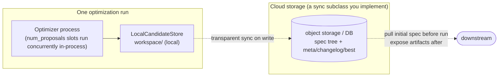

# Extensibility

> **English** · [中文](./extensibility.zh-CN.md)

AntOmniEvo strictly separates the "generic engine" from the "task-specific plugins": the framework owns the main loop, scheduling, reflection, memory, and checkpoint; **your task plugs into 7 pluggable components and lays out one editable-spec schema (`SpecSchema` — not a component)**, with zero main-loop changes across tasks.

## 1. Seven pluggable components

Per the paper, AntOmniEvo exposes **seven pluggable components across three roles**; swap the **target side** to add a system — the optimizer side and the store stay fixed, so the same machinery optimizes a skill, a harness, and a pipeline.

| Role | Component | Responsibility | Default / reference impls |
|---|---|---|---|
| target | `System` | Run the system under optimization (agent / workflow / single-file algorithm…) with a candidate spec; return `SystemResult` (trajectory + output + usage) | `ReactAgentSystem` (in-process) / `Text2SQLSystem` / `AppWorldSystem` / `TerminalBenchSystem` (subprocess) |
| target | `Evaluator` | Score a `SystemResult`; its `scoring_criteria()` text **is the objective** | `AtomicFactEvaluator` / `Text2SQLEvaluator` / `AppWorldEvaluator` / `TerminalBenchEvaluator` |
| target | `DataInst` + loader | One evaluation instance and how to load it | `BirdTestDataInst` / `MusiqueDataInst` / `AppWorldDataInst` / `TerminalBenchDataInst` |
| optimizer | `Optimizer` | The evolution loop: select → propose → evaluate → reflect → validate → eliminate, under a budget | base class + per-scenario subclasses |
| optimizer | `Proposer` | The coding agent that reads failures and rewrites the spec | `ClaudeCodeProposer` (drives `claude`), `PiCodingAgentProposer` (drives `pi`) |
| optimizer | `EvolutionAlgorithm` | Select who mutates, who is eliminated | `ParetoFrontierEvolutionAlgorithm` (micro-pareto: Pareto + top-N) |
| persistence | `CandidateStore` | Persist all state (spec tree, runs, analysis, changelog, statistics) | `LocalCandidateStore` (filesystem) |

## 2. Three independent extension axes

- **Swap the coding-agent backend**: subclass `BaseProposer` and implement one method `invoke_agent(prompt, cwd) -> (Trajectory, UsageStats)` to drive your own CLI; the two-phase pipeline, all templates, scripts, and reflection flow are inherited.
- **Swap the selection / elimination strategy**: implement a new `EvolutionAlgorithm` with only `select` / `eliminate`; the main loop is agnostic.
- **Cloud storage**: `CandidateStore` is an abstract ABC with a default `LocalCandidateStore` that keeps the evolution memory (spec tree, meta, changelog, statistics) on the local `workspace/`. One optimization run = one `Optimizer` process + one local store. To plug into cloud infra, **implement a "local + transparent-sync" `CandidateStore` subclass**: fully transparent to the optimizer, it still runs on the local `workspace/`, and on every write it also syncs artifacts to object storage / a DB (pull the initial spec before the run; push artifacts for downstream consumption afterwards). The optimizer main loop and its concurrency (`num_proposals` slots inside one process) are unchanged. **Note**: this is *not* "multiple workers sharing one store for cross-host concurrent evolution" — that's a different model the framework does not support out of the box.

## 3. The 7 components: which to write yourself

The seven pluggable components `Optimizer` assembles — **target side** (`System` / `Evaluator` / `DataInst`), **optimizer side** (`Optimizer` loop / `Proposer` / `EvolutionAlgorithm`), **persistence** (`CandidateStore`) — plus the **editable-spec schema** (`SpecSchema`) you lay out separately:

| # | Component | Default impl | Write your own? |
|---|---|---|---|
| 1 | `System` | 4 scenario references | **Yes** — run your system with a candidate's `spec_dir`; return `SystemResult`. |
| 2 | `Evaluator` | 4 scenario references | **Yes** — score a `SystemResult`; `scoring_criteria()` text **is the objective**. |
| 3 | `DataInst` + loader | 4 scenario references | **Yes** — one evaluation instance (`id`/`query`/`golden_answer` + your fields) and how to load it. |
| 4 | `Optimizer` | base class + per-scenario subclasses | Usually no — only override the hook `_run_and_evaluate` (under the base `_run_and_evaluate_wrapper`) when your `System` runs a whole batch in one subprocess needing `job_name`/`output_dir` kwargs; **don't** override the wrapper or you bypass `max_rollouts`/`max_system_runs` counting. |
| 5 | `Proposer` | `PiCodingAgentProposer` (`pi`), `ClaudeCodeProposer` (`claude`) | Usually no — pick one; only subclass `BaseProposer` + implement `invoke_agent(prompt, cwd)` to drive a different coding agent. |
| 6 | `EvolutionAlgorithm` | `ParetoFrontierEvolutionAlgorithm` (micro-pareto) | Usually no — only to change selection/elimination. |
| 7 | `CandidateStore` | `LocalCandidateStore` (filesystem) | Usually no — implement the ABC only for distributed/remote storage. |

> **`SpecSchema`** (`antomnievo/model/spec_defs/<your>_spec_def.py`) is **not** one of the seven — it's the **editable-spec declaration**: with `FolderSchema` / `FileSchema` you declare the spec directory tree and what each file is for, which is both the proposer's only source for "which files it may touch" *and* the mapping of your system's editable part onto that directory. You **must** write it for a new task (same standing as `System` / `Evaluator` / `DataInst`), but it's a declarative schema you lay out, not a pluggable component.
>
> The **initial spec directory** (`tasks/<your>-base/`, the root candidate's seed) and the **entry-point script** (wires components + data + hyperparameters and calls `await optimizer.optimize()`) are also inputs you provide, not components.

**Implementation pointers** — the table says *what*; these say *where* and *how* to land the ones you write:

- **`DataInst`** (`antomnievo/dataset/<your>/`): subclass `DataInst` (already declares `id`/`query`/`golden_answer`), add your domain fields; add a loader returning `list[YourDataInst]`. Train/val split is up to you.
- **`System`** (`antomnievo/system/<your>/`): subclass `System` and either implement `_run` (in-process) **or** override `run_batch` (subprocess). The load-bearing input is `candidate_meta.spec_dir` — your system must read its spec from that directory.
  - In-process: per-instance `_run` returns `SystemResult(trajectory=..., output=RolloutResult(content=...), usage=...)`.
  - Batch subprocess: override `run_batch`, call your CLI once, parse one `SystemResult` per `data_inst` back out of `output_dir`.
- **`Evaluator`** (`antomnievo/evaluator/<your>/`): implement `scoring_criteria()` (**the objective**) + `_evaluate` (return `EvaluationResult(data_id, metric_name, score, reason)`).
- **`SpecSchema`**: see the note above (`antomnievo/model/spec_defs/<your>_spec_def.py`, `FolderSchema`/`FileSchema`).
- **`Optimizer`**: see row 4 above — only the hook `_run_and_evaluate`, never the wrapper.
