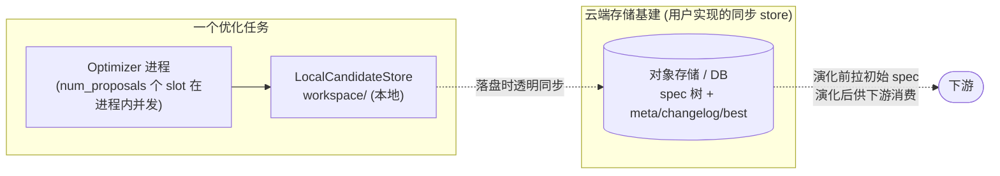

# 可扩展性

> [English](./extensibility.md) · **中文**

AntOmniEvo 把「通用机器」和「任务相关插件」严格分离:框架拥有主循环、调度、反射、记忆、checkpoint,**你的任务接 7 个可插拔组件、并 lay out 一份 editable-spec 声明(`SpecSchema`,不算组件)**,换任务零改主循环。

## 1. 7 个可插拔组件

按论文,AntOmniEvo 暴露 **7 个可插拔组件、分三类**:换**目标侧**即加一个新系统——优化器侧与存储保持不变,所以同一套机器能优化 skill、harness、pipeline。

| 角色 | 组件 | 职责 | 默认 / 参照实现 |
|---|---|---|---|
| 目标侧 | `System` | 用候选 spec 跑被优化系统(Agent / workflow / 单文件算法…),返回 `SystemResult`(轨迹 + 输出 + usage) | `ReactAgentSystem`(进程内)/ `Text2SQLSystem` / `AppWorldSystem` / `TerminalBenchSystem`(subprocess) |
| 目标侧 | `Evaluator` | 给 `SystemResult` 打分;`scoring_criteria()` 文本**就是目标定义** | `AtomicFactEvaluator` / `Text2SQLEvaluator` / `AppWorldEvaluator` / `TerminalBenchEvaluator` |
| 目标侧 | `DataInst` + loader | 一条评估实例与怎么 load | `BirdTestDataInst` / `MusiqueDataInst` / `AppWorldDataInst` / `TerminalBenchDataInst` |
| 优化器侧 | `Optimizer` | 进化主循环:select → propose → evaluate → reflect → validate → eliminate,受 budget 约束 | 基类 + 各场景子类 |
| 优化器侧 | `Proposer` | 读失败运行、改写 spec 的 coding agent | `ClaudeCodeProposer`(驱动 `claude`)、`PiCodingAgentProposer`(驱动 `pi`) |
| 优化器侧 | `EvolutionAlgorithm` | 选谁变异、淘汰谁 | `ParetoFrontierEvolutionAlgorithm`(micro-pareto:Pareto + top-N) |
| 持久化 | `CandidateStore` | 落盘所有状态(spec 树、run、analysis、changelog、statistics) | `LocalCandidateStore`(文件系统) |

## 2. 三个独立扩展维度

- **换 coding-agent 后端**:继承 `BaseProposer`、实现 `invoke_agent(prompt, cwd) -> (Trajectory, UsageStats)` 一个方法即可接入你自己的 CLI;两阶段流程、所有模板、脚本、Mara 链全部继承。
- **换选择 / 淘汰策略**:实现新的 `EvolutionAlgorithm`,只需 `select` / `eliminate` 两个方法,主循环不感知。
- **上云端存储**:`CandidateStore` 是抽象 ABC,默认 `LocalCandidateStore` 把进化记忆(spec 树、meta、changelog、statistics)落在本地 `workspace/`。一个优化任务 = 一个 `Optimizer` 进程 + 一份本地 store;想接云端基建时,**实现一个「本地 + 透明同步」的 `CandidateStore` 子类**:对优化器完全透明,内部仍用本地 `workspace/` 跑,每次落盘的同时把产物同步到对象存储 / DB(拉初始 spec、上推最佳候选供下游消费)。优化器主循环与并发(`num_proposals` 个 slot 在单进程内)逻辑完全不变。**注意**:不是「多 worker 共享一个 store 去跨机并发进化」——那是另一种模型,当前框架不开箱支持。

## 3. 7 个组件:谁要自己写

`Optimizer` 装配 **7 个可插拔组件**——**目标侧** `System` / `Evaluator` / `DataInst`、**优化器侧** `Optimizer`(主循环)/ `Proposer` / `EvolutionAlgorithm`、**持久化** `CandidateStore`——外加你单独 lay out 的 **editable-spec 声明**(`SpecSchema`):

| # | 组件 | 默认实现 | 要自己写吗 |
|---|---|---|---|
| 1 | `System` | 4 个场景参照 | **必写** —— 拿候选 `spec_dir` 跑你的系统,返回 `SystemResult`。 |
| 2 | `Evaluator` | 4 个场景参照 | **必写** —— 给 `SystemResult` 打分;`scoring_criteria()` **就是目标定义**。 |
| 3 | `DataInst` + loader | 4 个场景参照 | **必写** —— 一条评估实例(`id`/`query`/`golden_answer` + 你的字段)和怎么 load。 |
| 4 | `Optimizer` | 基类 + 各场景子类 | 通常不用。仅当 `System` 整批跑一个子进程、要透传 `job_name`/`output_dir` 等 kwargs 时重写 `_run_and_evaluate` 钩子(注意:基类入口 `_run_and_evaluate_wrapper` 已负责 rollout/计数,子类重写的是它下面的钩子,不要重写 wrapper 否则会绕过 `max_rollouts`/`max_system_runs` 计数)。 |
| 5 | `Proposer` | `PiCodingAgentProposer`(`pi`)、`ClaudeCodeProposer`(`claude`) | 通常不用。二选一;只有接别的 coding agent 才继承 `BaseProposer` 实现 `invoke_agent(prompt, cwd)`。 |
| 6 | `EvolutionAlgorithm` | `ParetoFrontierEvolutionAlgorithm`(micro-pareto) | 通常不用。想换选择/淘汰策略才实现。 |
| 7 | `CandidateStore` | `LocalCandidateStore`(文件系统) | 通常不用。要分布式/远端存储才实现 ABC。 |

> **`SpecSchema`**(`antomnievo/model/spec_defs/<your>_spec_def.py`)**不是 7 个组件之一**,而是 **editable-spec 声明**:用 `FolderSchema` / `FileSchema` 声明 spec 目录树与每个文件含义——既是 proposer 知道「能碰哪些文件」的唯一来源,也是「把系统可编辑部分映射成这个目录」的声明。新任务**必写**(与 `System` / `Evaluator` / `DataInst` 同级),但它是你 lay out 的声明式 schema,不是可插拔组件。
>
> **初始 spec 目录**(`tasks/<your>-base/`,root 候选的种子)和**入口脚本**(把组件 + 数据 + 超参拼起来、调 `await optimizer.optimize()`)也是你提供的输入,不是组件。

**落地要点** —— 上表回答"写哪些",这里给"放哪 / 怎么写",只给你真正要自己写的那几个:

- **`DataInst`**(`antomnievo/dataset/<your>/`):继承 `DataInst`(已声明 `id`/`query`/`golden_answer`),加你的领域字段;加个 loader 返回 `list[YourDataInst]`。train/val 怎么切随你。
- **`System`**(`antomnievo/system/<your>/`):继承 `System`,要么实现 `_run`(进程内)**要么**重写 `run_batch`(子进程)。load-bearing 的输入是 `candidate_meta.spec_dir` —— 你的系统必须从这目录读 spec。
  - 进程内:逐条 `_run` 返回 `SystemResult(trajectory=..., output=RolloutResult(content=...), usage=...)`。
  - 整批子进程:重写 `run_batch` 调一次 CLI 再从 `output_dir` 反解每条 `SystemResult`。
- **`Evaluator`**(`antomnievo/evaluator/<your>/`):实现 `scoring_criteria()`(**目标定义**)+ `_evaluate`(返回 `EvaluationResult(data_id, metric_name, score, reason)`)。
- **`SpecSchema`**:见上面的注(`antomnievo/model/spec_defs/<your>_spec_def.py`,`FolderSchema`/`FileSchema`)。
- **`Optimizer`**:见上表第 4 行 —— 只重写钩子 `_run_and_evaluate`,别碰 wrapper。
