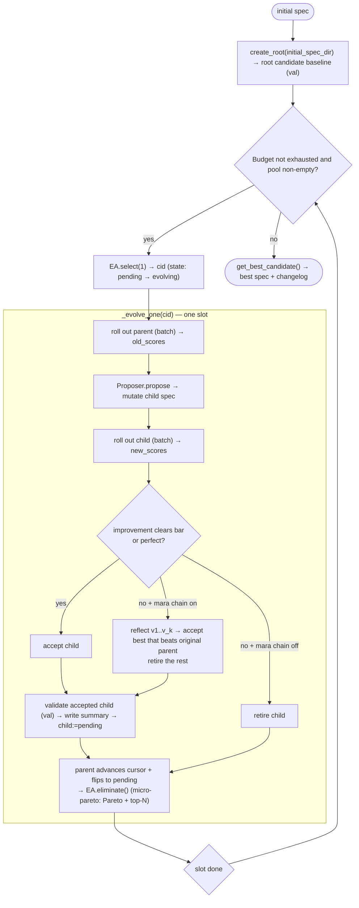
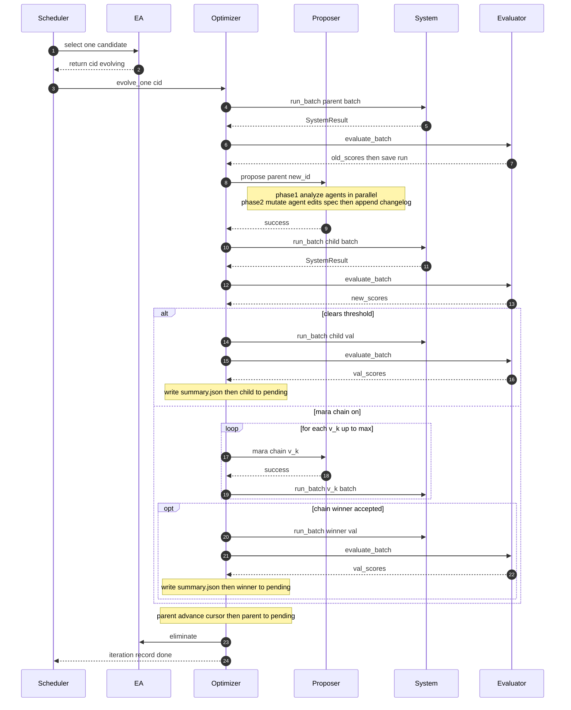

# System design

> **English** · [中文](./system-design.zh-CN.md)

## 1. One-sentence mental model

```
(trajectory, output) = System(B, x)                          # your system runs with spec B on data x
(score, reason)      = Evaluator(output)                     # score it
B'                   = Proposer(B, runs, scores)             # a coding agent reads failures + scores, rewrites B
B_{next}             = EvolutionAlgorithm.choose(B, B', …)   # keep winners, drop losers
```

One **iteration (slot)** = pick a parent → mutate a child spec off it → roll out parent and child on one training batch → compare scores → if the child clears the bar, validate on the val set and accept. A classic "1+1 evolution with Pareto-frontier maintenance" structure.



## 2. Top-level layout

```
antomnievo/
├── interface/           # abstract contracts: System / Evaluator / Proposer / EvolutionAlgorithm / CandidateStore / DataInst
├── optimizer/           # main loop Optimizer + per-scenario subclasses
├── proposer/            # Proposer impls: base + claude_code + pi_coding_agent + templates/scripts/utils
├── system/              # reference impls of systems-under-optimization: langgraph / text2sql / appworld / terminalbench
├── evaluator/           # reference Evaluator impls
├── dataset/             # reference DataInst subclasses + loaders
├── store/               # LocalCandidateStore: filesystem-backed candidate storage
├── evolution_algorithm/ # evolution algorithms: ParetoFrontierEvolutionAlgorithm
├── model/               # pydantic models: CandidateMeta / RunAnalysis / ChangeLogEntry / Budget / spec_schema …
└── common/              # config / theta_llm / utils / tool(rag)
visualizer/              # standalone React + Flask visualizer (separate package `ant-omnievo-visualizer`)
tasks/                   # initial spec directories
```

## 3. Inside a slot

1. **Derive batch** (`_derive_batch`): starting at the parent's own `(epoch, dataset_index)` cursor, take `batch_size` items; tail-align and wrap to `(epoch+1, 0)` at the end. Snapshot semantics: advance even on failure.
2. **Roll out parent** (baseline) and **roll out child** (mutated), both on the same batch (so `challenge` is comparable).
3. **Challenge** (`_step_challenge_parent`): improvement = sum(new_scores) − sum(old_scores). Clears `min_improvement_per_batch` or perfect → accept; below threshold and `max_reflection_iterations ≤ 0` (mara chain off) → `retire`; below threshold with mara chain on → mara chain.
4. **Mara chain** (`_step_reflect`): `root → v0 → v1 → … → v_k`; each level's `proposer.reflect` produces a new candidate rolled out on the same batch, with early stop on clearing the threshold / perfect; accept the best chain member that beats the original parent, `retire` the rest.
5. **Validate** (`_step_validate`): an accepted child — whether accepted directly or as the mara-chain winner — is re-scored on val, `summary.json` written, flipped to `pending`.
6. **Parent advances cursor + flips to pending**; **`eliminate` runs after every slot**, keeping the population pruned.
7. **Bookkeeping**: append `iteration_records.jsonl`, update `statistics`.

Interaction inside one slot (multiple slots run concurrently without interfering):



> Rollout counting: `_run_and_evaluate_wrapper` adds `len(data_list)` per call to two counters — `current_rollouts` only on the train split (parent / child / each mara-chain child; validation runs and the root baseline on the val split are excluded), bounded by `Budget.max_rollouts`; and `current_system_runs` on every split (incl. val/baseline), bounded by `Budget.max_system_runs`. The base-class wrapper centralizes both counts; subclasses override the hook `_run_and_evaluate` underneath it, so they cannot bypass either.

## 4. Candidate storage: on-disk layout and state machine

```
{workspace_dir}/
├── candidates/{candidate_id}/           # 12-hex id (uuid4().hex[:12])
│   ├── spec/                             # the mutable spec tree (Phase-2 agent's cwd)
│   └── data/
│       ├── meta.json                     # CandidateMeta
│       ├── summary.json                  # CandidateSummary (val scores)
│       ├── changelog.jsonl               # append-only lineage, one ChangeLogEntry per line
│       ├── system_run/{data_id}/run_{YYYYMMDD_HHMMSS}.json    # train RunRecord
│       ├── val_system_run/{data_id}/run_{timestamp}.json      # val RunRecord (proposer off-limits)
│       └── proposer_run/
│           ├── analysis/
│           │   ├── trajectory/{child_id}.json  # Phase-1 merged Trajectory
│           │   └── result/{data_id}.json       # one RunAnalysis per data_id
│           └── mutation/{child_id}.json        # Phase-2 Trajectory
└── logs/
    ├── statistics.json                   # OptimizationStatistics (overwritten in place)
    ├── iteration_records.jsonl           # one line per slot (append-only)
    └── parameters.jsonl                  # one line per optimizer launch (append-only)
```

Key `CandidateMeta` fields: `candidate_id` / `spec_dir` / `data_dir` / `parent_id` / `children_ids` / `created_at` / `state` / `epoch` / `dataset_index` / `generation` / `reflection_depth`.

State machine: `pending` (selectable) ↔ `evolving` (occupying a slot) ↔ `unavailable` (just-created / eliminated). Changelog is append-only, child inherits parent, so lineage accumulates down the inheritance chain; resume relies on the state machine + startup recovery (`reset_evolving_to_pending` + `cleanup_unavailable` policy). No enforced transition guard; transitions are driven by the main loop.

## 5. Proposer: two-phase flow (an agent optimizing a system)

- **Phase 1 — Analyze** (`_analyze`): `find_unanalyzed_runs` finds runs newer than the latest analysis, grouped by `data_id`; **one coding agent per `data_id` in parallel** (cwd = parent's `data_dir`), reading the spec (read-only) + run files, producing one `RunAnalysis` (`trajectory_analysis` observations + `actions` prescriptions), then `validate-analysis` self-check. Per-`data_id` trajectories are merged and saved to `analysis/trajectory/{new_id}.json`.
- **Phase 2 — Mutate** (`_mutate`): one coding agent (cwd = child's `spec_dir`) reads all analyses, dedups / resolves contradictions, edits files in place, recording `mtime_before`; the Phase-2 trajectory is persisted **before** any error short-circuit (`trajectory.errors` non-empty → fail; no files changed → fail), then **must** run `append-changelog` to append the diff to `{new_data_dir}/changelog.jsonl`.
- **`RunAnalysis`**: `data_id` + `trajectory_analysis: list[str]` + `actions: list[SpecAction]` + `data_quality_issues: list[str]` (mutually exclusive with the above). `SpecAction` = `file` (concrete path relative to spec root) + `operation` (add/delete/modify) + `spec_issue` (diagnosis) + `change` (modify uses BEFORE/AFTER) + `resolves[]` (indices into `trajectory_analysis`, must be non-empty and in range).
- **Reflection flow** (`reflect`): Phase 1 swaps in `REFLECTION_ANALYSIS_PROMPT_TEMPLATE`, pre-loading the whole chain context (chain_id_path, per-data score table with Δ columns, attributed changelog, every chain link's prior analysis for that `data_id`, chain-link run files) into the prompt, forcing the five-method diagnosis + A–I diagnosis table, preferring REMOVE/REPLACE, citing the responsible chain link in `spec_issue`, hunting "lost wins." Phase 2 is mechanically unchanged; all chain learning lives only in the analysis JSON layer.
- **The two built-in backends** differ only in the CLI: `ClaudeCodeProposer` (`claude --print --output-format stream-json --dangerously-skip-permissions …`) relies on prompt-declared access rules; `PiCodingAgentProposer` (`pi --mode json -e block-val-system-run.ts -e enforce-changelog-cli.ts …`) uses extensions to hard-block "read val" + "bypass changelog CLI." The Pi path is more controlled.

## 6. Evolution algorithm `ParetoFrontierEvolutionAlgorithm`

- **`select(num)`**: select only from `pending`; compute each candidate's `max_score_count` (how many dimensions / `data_id`s it achieves the population-wide best score on) and weighted-random-sample without replacement; uniform-random when no scores exist; empty return = "no work," scheduler waits for an in-flight slot. Intuition: multi-dimension leaders first, protecting versatile candidates.
- **`eliminate()`**: both `pending` and `evolving` participate, only `pending` can be retired. Phase 1 Pareto weak-dominance pruning (A dominates B iff A ≥ B on every dimension), Phase 2 keeps top N by `(avg_score, generation, created_at)` when survivors exceed `max_candidate_num`. This combined strategy is called **micro-pareto**.

## 7. Budget and stopping

`Budget(max_iterations, max_rollouts, max_system_runs, max_tokens, max_elapsed_seconds)`: once any set limit is hit, no new slots open; in-flight slots drain. `is_exhausted` short-circuits in order iteration → rollouts → system_runs → tokens → elapsed; `current_rollouts` is bumped at the top of `_run_and_evaluate_wrapper` by `len(data_list)`, train split only (the root baseline runs on val, so it is excluded from `current_rollouts` but still counted in `current_system_runs`).

## 8. Design points, summarized

1. **The spec is the optimization target — a directory of files** — letting "optimization" use a mature coding agent that edits files directly, not a constrained-DSL search.
2. **Not limited to agents** — any "editable file directory + repeatable evaluation" system works (workflows / single-file algorithms alike).
3. **Two-phase separation + quality gates** — analysis structured, mutation deduped/contradiction-resolved, each with its own prompt and validation.
4. **Changelog is the source of truth for lineage** — append-only, child inherits parent, keeping an unreliable-LLM mutation loop traceable.
5. **Strict val-set isolation from the proposer** — prevents val overfitting.
6. **Checkpoint resume** — state machine + complete on-disk artifacts + startup recovery.
7. **Concurrency + single-threaded asyncio** — multiple candidates evolving concurrently; synchronous operations are already atomic, no locks.
8. **Pragmatic micro-pareto** — acknowledging pure Pareto fails under probabilistic scoring, top-N fallback + multi-dimension-leadership weighting protects versatile candidates.
9. **Cloud-storage integration** — `CandidateStore` ABC; implement a "local + transparent sync" subclass that runs locally while syncing artifacts to object storage / a DB for downstream consumption.
