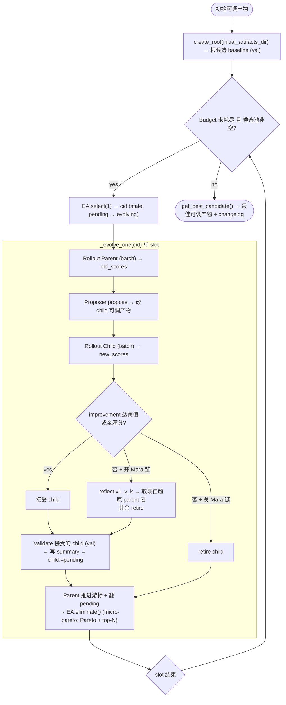
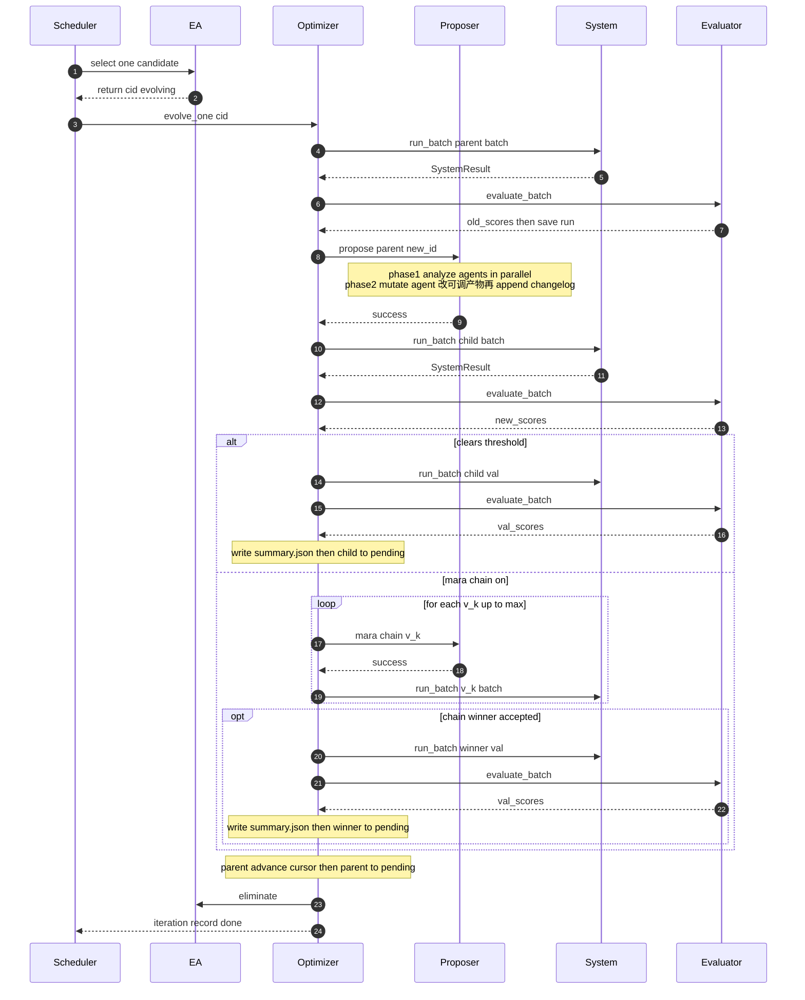

# 系统设计

> [English](./system-design.md) · **中文**

## 1. 一句话心智模型

```
(trajectory, output) = System(B, x)                          # 你的系统用可调产物 B 在数据 x 上跑
(score, reason)      = Evaluator(output)                     # 打分
B'                   = Proposer(B, runs, scores)             # coding agent 读失败运行 + 分数,改写可调产物
B_{next}             = EvolutionAlgorithm.choose(B, B', …)   # 留下赢的,淘汰输的
```

一次「迭代(slot)」= 选一个 parent → 在其可调产物基础上变异出 child → 在一批训练数据上 rollout parent 与 child → 比较分数 → 若 child 达标则验证集评估并接受。典型「1+1 进化 + Pareto 前沿维护」结构。



## 2. 顶层目录结构

```
antomnievo/
├── interface/           # 抽象契约: System / Evaluator / Proposer / EvolutionAlgorithm / CandidateStore / DataInst
├── optimizer/           # 主循环 Optimizer + 各场景子类
├── proposer/            # Proposer 实现: base + claude_code + pi_coding_agent + 模板/脚本/utils
├── system/              # 被优化系统的参照实现: langgraph / text2sql / appworld / terminalbench
├── evaluator/           # Evaluator 参照实现
├── dataset/             # DataInst 子类与 loader 参照
├── store/               # LocalCandidateStore: 文件系统实现的 candidate 存储
├── evolution_algorithm/ # 进化算法: ParetoFrontierEvolutionAlgorithm
├── model/               # pydantic 模型: CandidateMeta / RunAnalysis / ChangeLogEntry / Budget / tunable_artifact_schema …
└── common/              # config / theta_llm / utils / tool(rag)
visualizer/              # 独立的 React + Flask 可视化前端(单独的子包 `ant-omnievo-visualizer`)
tasks/                   # 初始可调产物目录
```

## 3. 一个 slot 内发生了什么

1. **派生 batch**(`_derive_batch`):按 parent 自己的 `(epoch, dataset_index)` 游标取 `batch_size` 条;游标到底做 tail-aligned 对齐并 `epoch+1, index=0`。游标推进是 snapshot 语义:失败也推进。
2. **Rollout parent**(基线)、**Rollout child**(变异后),二者在同一 batch 上跑(`challenge` 可比)。
3. **Challenge**(`_step_challenge_parent`):improvement = sum(new_scores) − sum(old_scores)。达 `min_improvement_per_batch` 或全满分 → 接受;未达标且关 Mara 链(`max_reflection_iterations ≤ 0`)→ `retire`;未达标且开 Mara 链 → 进 Mara 链。
4. **Mara 链**(`_step_reflect`):`root → v0 → v1 → … → v_k`,每层 `proposer.reflect` 出新候选、同 batch rollout,达标或满分早停;取链中 batch-sum 最大且超 original parent 者接受,其余全部 retire。
5. **Validation**(`_step_validate`):接受的 child——无论直接接受还是 Mara 链胜出——在 val 集再评一次,写 `summary.json`,翻 `pending`。
6. **Parent 推进游标 + 翻回 pending**,重新进池竞争;**每个 slot 后调 `eliminate`**,种群一直被裁。
7. **记账**:写 `iteration_records.jsonl`,更新 `statistics`。

单 slot 内部时序(并发时多 slot 互不干扰):



> rollout 计数:`_run_and_evaluate_wrapper` 每次 `len(data_list)` 累计两个量 —— `current_rollouts` 只计 train split(parent / child / 每个 Mara 链子候选),验证 run 与根 baseline(val split)不计,受 `Budget.max_rollouts` 约束;`current_system_runs` 计全 split(含 val/baseline),受 `Budget.max_system_runs` 约束。基类入口统一计数,子类重写的是它下面的钩子 `_run_and_evaluate`,不会绕过计数。

## 4. 候选存储:磁盘布局与状态机

```
{workspace_dir}/
├── candidates/{candidate_id}/           # 12-hex id (uuid4().hex[:12])
│   ├── artifact/                             # 可被变异的可调产物树(Phase-2 agent 的 cwd)
│   └── data/
│       ├── meta.json                     # CandidateMeta
│       ├── summary.json                  # CandidateSummary (val 分数)
│       ├── changelog.jsonl               # append-only lineage,每条一个 ChangeLogEntry
│       ├── system_run/{data_id}/run_{YYYYMMDD_HHMMSS}.json    # 训练 RunRecord
│       ├── val_system_run/{data_id}/run_{timestamp}.json      # 验证 RunRecord(proposer 禁区)
│       └── proposer_run/
│           ├── analysis/
│           │   ├── trajectory/{child_id}.json  # Phase-1 合并 Trajectory
│           │   └── result/{data_id}.json       # 一个 data_id 一份 RunAnalysis
│           └── mutation/{child_id}.json        # Phase-2 Trajectory
└── logs/
    ├── statistics.json                   # OptimizationStatistics(整体覆写)
    ├── iteration_records.jsonl           # 每个 slot 一行(append-only)
    └── parameters.jsonl                  # 每次 optimizer launch 一行(append-only)
```

`CandidateMeta` 关键字段:`candidate_id` / `artifact_dir` / `data_dir` / `parent_id` / `children_ids` / `created_at` / `state` / `epoch` / `dataset_index` / `generation` / `reflection_depth`。

状态机:`pending`(可被选)↔ `evolving`(占槽中)↔ `unavailable`(刚创建/已淘汰)。changelog append-only、child 继承 parent,所以 lineage 沿继承链累积;断点续跑靠状态机 + 启动恢复(`reset_evolving_to_pending` + 按 `cleanup_unavailable` 决定是否清理 unavailable)。无强制转换守卫,转换由主循环驱动。

## 5. Proposer:两阶段流程(让 Agent 优化系统)

- **Phase 1 分析**(`_analyze`):`find_unanalyzed_runs` 找出比最新 analysis 新的 run,按 `data_id` 分组;**每个 data_id 并发起一个 coding agent**(cwd = parent `data_dir`),读可调产物(只读)+ run 文件,产出一份 `RunAnalysis`(`trajectory_analysis` 观察 + `actions` 处方),跑 `validate-analysis` 自检。所有 per-data_id trajectory 合并落盘到 `analysis/trajectory/{new_id}.json`。
- **Phase 2 变异**(`_mutate`):起一个 coding agent(cwd = child `artifact_dir`),读多份 analysis、去重 / 消解矛盾、原地改文件、记下 `mtime_before`;跑完先落盘 Phase-2 trajectory 再判错(`trajectory.errors` 非空 → 失败;无文件改动 → 失败),然后**必须**跑 `append-changelog` 把 diff 追加到 `{new_data_dir}/changelog.jsonl`。
- **`RunAnalysis`**:`data_id` + `trajectory_analysis: list[str]` + `actions: list[ArtifactAction]` + `data_quality_issues: list[str]`(与上面互斥)。`ArtifactAction` = `file`(相对 artifact 根的具体路径)+ `operation`(add/delete/modify)+ `artifact_issue`(诊断)+ `change`(modify 用 BEFORE/AFTER)+ `resolves[]`(回指 `trajectory_analysis` 下标,必须非空且在范围内)。
- **反思流程**(`reflect`):Phase 1 改用 `REFLECTION_ANALYSIS_PROMPT_TEMPLATE`,把整条链上下文(chain_id_path、逐题分数表带 Δ 列、归属化 changelog、每个链节对该 data_id 已有 analysis、链节 run 文件)**预加载进 prompt**,强制五法诊断 + A–I 诊断表,偏好 REMOVE/REPLACE、要求点名责任链节、找「丢失的赢点」。Phase 2 机制完全不变,链路学习只体现在 analysis JSON 一层。
- **两个内置后端**只差用哪个 CLI:`ClaudeCodeProposer`(`claude --print --output-format stream-json --dangerously-skip-permissions …`)走 prompt 声明访问控制;`PiCodingAgentProposer`(`pi --mode json -e block-val-system-run.ts -e enforce-changelog-cli.ts …`)用 extension 硬拦「读 val」+「绕过 changelog CLI」。Pi 路线更受控。

## 6. 进化算法 `ParetoFrontierEvolutionAlgorithm`

- **`select(num)`**:只在 `pending` 里选;算每个候选的 `max_score_count`(在多少个维度/`data_id` 上拿到全种群最高分)作权重加权随机采样(不放回);无分数时均匀随机;空返回 = 「没活」,调度器等在飞 slot 完成再重试。直观:多维度领导者优先,保护多面手。
- **`eliminate()`**:`pending`+`evolving` 都参与比较,只 retire `pending`。Phase 1 Pareto 弱支配剪枝(A 支配 B iff A 每维 ≥ B),Phase 2 超过 `max_candidate_num` 时按 `(avg_score, generation, created_at)` 降序保留前 N。这套组合策略称为 **micro-pareto**。

## 7. 预算与停止

`Budget(max_iterations, max_rollouts, max_system_runs, max_tokens, max_elapsed_seconds)`:任一上限达到不再开新 slot,在飞 slot 跑完(drain)。`is_exhausted` 按 iteration → rollouts → system_runs → tokens → elapsed 顺序短路;`current_rollouts` 在 `_run_and_evaluate_wrapper` 开头按 `len(data_list)` 累计、只计 train split(根候选 baseline 跑在 val 上,不计入 rollouts,但计入 `current_system_runs`)。

## 8. 设计要点小结

1. **可调产物是被优化对象,就是一目录文件** —— 让「优化」用成熟 coding agent 直接改文件,而非受限 DSL 搜参。
2. **不限于 Agent** —— 凡「可调文件目录 + 可重复评估」的系统皆可(workflow / 单文件算法同理)。
3. **两阶段分离 + 质量门** —— 分析结构化、变异去重消解矛盾,各自独立 prompt 与校验。
4. **changelog 是 lineage 真相源** —— append-only、child 继承 parent,在不可靠 LLM 变异里维持可追溯。
5. **val 集对 proposer 硬隔离** —— 防过拟合验证集。
6. **断点续跑** —— 状态机 + 盘上完整产物 + 启动恢复。
7. **并发 + 单线程 asyncio** —— 多候选同时进化,同步操作天然原子,无需锁。
8. **务实的 micro-pareto** —— 承认概率评分下纯 Pareto 失效,top-N 兜底 + 多维领先加权保护多面手。
9. **可接云端存储** —— `CandidateStore` ABC 抽象,实现一个「本地 + 透明同步」子类即可在本地跑的同时把产物同步到对象存储 / DB,供下游消费。
