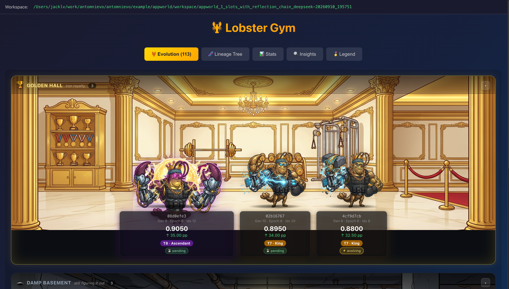
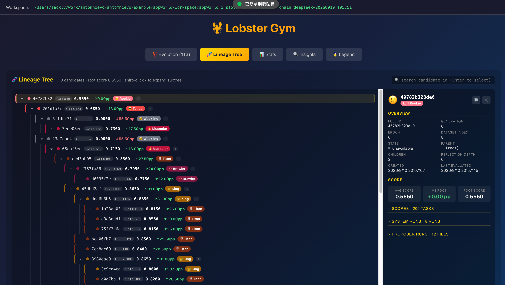
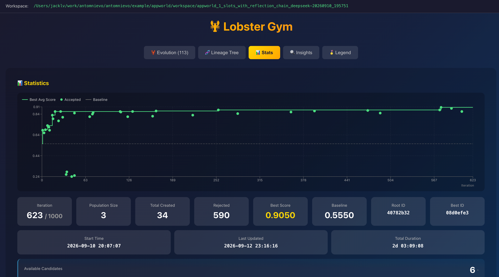
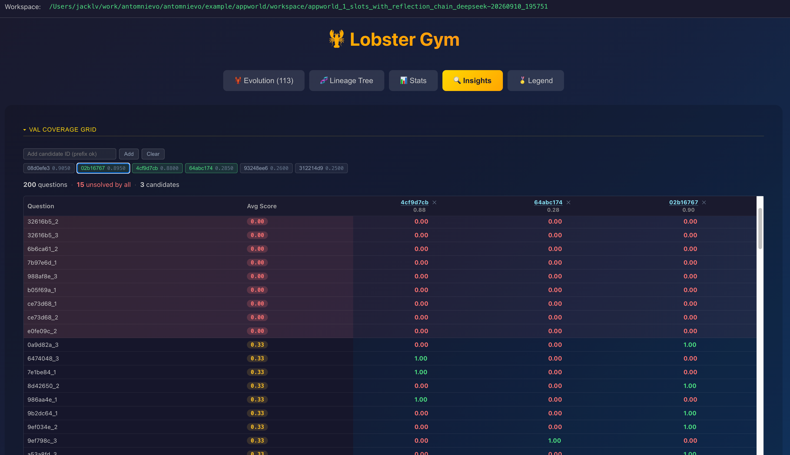
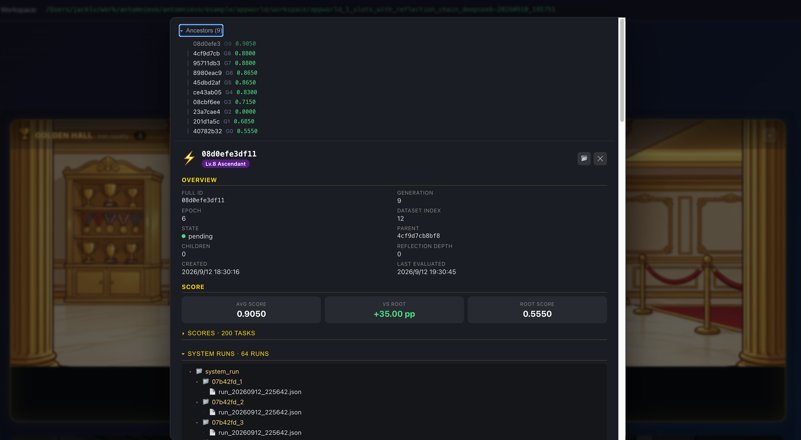
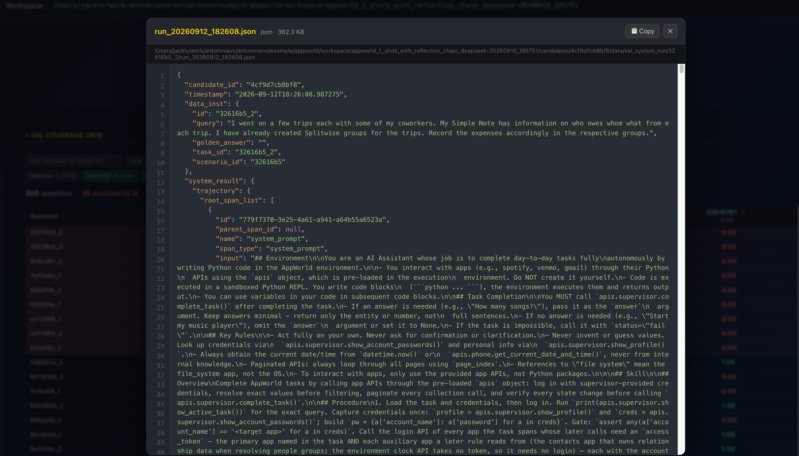

# Visualizer

> **English** · [中文](./visualizer.zh-CN.md)

A React + TypeScript + Flask front-end that renders an evolution run from its workspace directory. It is a separate package, `ant-omnievo-visualizer`, under `visualizer/`.

## 1. Install

**pip** (two steps, from the repo root):

```bash
pip install -e .             # core ant-omnievo
pip install -e ./visualizer  # visualizer (adds ant-omnievo + flask deps)
cd visualizer && npm install # front-end build deps
```

**uv** (one step, from the repo root):

```bash
uv pip install -e ".[visualizer]"  # via [tool.uv.sources]: core + visualizer in one go
cd visualizer && npm install
```

## 2. Start

```bash
cd visualizer
antomnievo-visualizer-manage start
```

- Front-end: http://localhost:5173
- API: http://localhost:3001

`Ctrl+C` to stop. Point the front-end at the `workspace/<run>` directory you want to inspect.

## 3. UI tour

**Evolution — Lobster Gym.** The population rendered as a gym: candidates train as lobsters, grouped into tier rooms by score (Golden Hall at the top, Damp Basement at the bottom). Each card shows the candidate's short id, generation/epoch/index, average score, gain vs. root, tier, and live state (pending / evolving).



**Lineage Tree.** The full parent–child tree of every candidate, with per-node score, delta vs. root, and tier badge. `shift+click` expands a whole subtree; selecting a node opens its detail panel on the right.



**Stats.** Best-average-score curve over iterations (with accepted candidates and the baseline), plus run-level counters: iteration progress, population size, total created, rejected, best score, root/best ids, and elapsed time.



**Insights.** Per-question coverage grid: pick any set of candidates and compare their scores on every dataset question side by side, with unsolved-by-all questions highlighted.



**Candidate details.** Clicking a candidate opens its panel: ancestor chain with per-generation scores, overview metadata (state, parent, reflection depth, timestamps), score vs. root, and browsable system-run / proposer-run files.



**File viewer.** Every artifact under the candidate's workspace directory (system runs, proposer runs, scores) opens in an in-app viewer with syntax highlighting and one-click copy.


